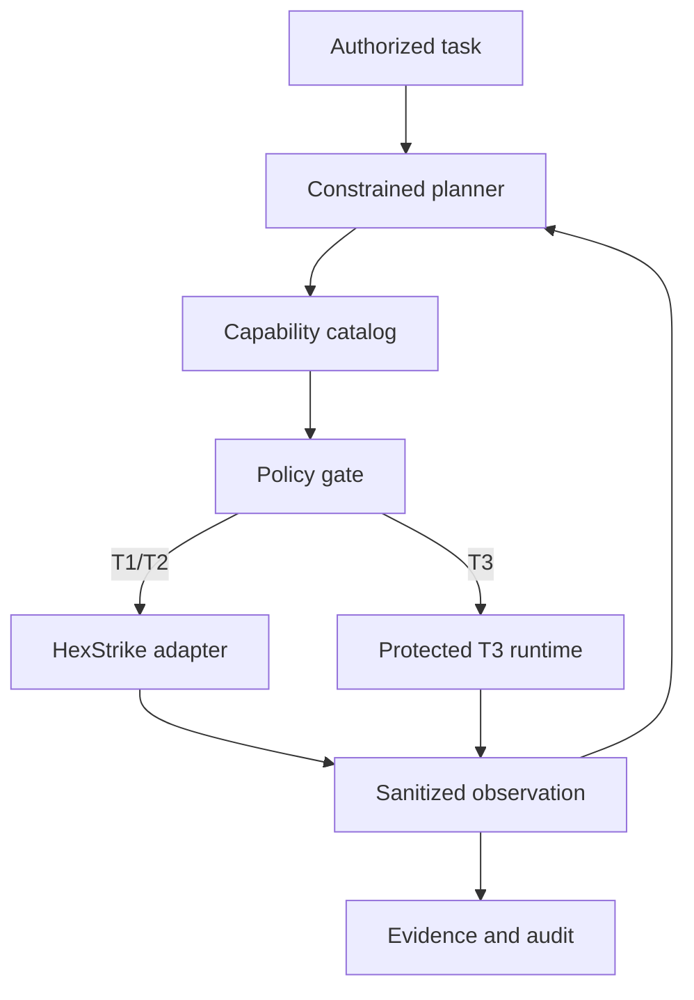

# Agent Evaluation Harness

Research PoC for policy-controlled, auditable assessment of explicitly approved lab assets.
It is not a production security product and does not claim full OWASP AISVS, OWASP Top 10,
or ISO/IEC 42001 compliance.

## Unified Agent workflow



The planner selects only a capability ID and reason. Asset addresses, profiles, tools,
ports, flags, credentials, fixed T3 actions, timeouts, and output limits are resolved by
server-side registries. Unknown or ineligible capabilities and extra planner fields are
denied. Observed HTTP, SMB, RDP, and SSH services control which capability can become
eligible next.

T1, T2, T3-A, and T3-B execute without Authorization or per-action human approval, but
every action still crosses the policy, asset, profile/tool, prerequisite, limit, evidence,
kill-switch, and audit boundaries. Only T3-C requires Authorization and a human-issued,
single-use permit. T3-C approval pauses and later resumes the same Agent run; it is not
a terminal success. No generic SSH, PowerShell, or shell executor exists.

`capabilities.yaml` is the authoritative Agent-visible catalog. Policy-only entries such
as credential extraction, password guessing, persistence, and lateral-movement tools are
not Agent capabilities. `arp-scan` and `nc` are also excluded because they still use
legacy `/api/tools/*` endpoints rather than the hardened cancellable job path.

## Ollama Gemma 4 planner

The optional local planner uses Ollama's loopback HTTP API. It receives only the
authorized task, eligible capability IDs with short descriptions, sanitized observations,
the bounded budget, and stop behavior. It cannot provide targets, profiles, arguments,
credentials, approvals, authorization, or policy. Local validation and the orchestrator
remain authoritative even when the prompt or an observation is hostile.

```bash
ollama serve                         # only when port 11434 is not already listening
ollama list                          # copy the exact installed Gemma 4 tag
export OLLAMA_MODEL=gemma4:e4b       # example; do not assume this tag elsewhere
export OLLAMA_BASE_URL=http://127.0.0.1:11434
export OLLAMA_TIMEOUT_SECONDS=30
export OLLAMA_MAX_RESPONSE_BYTES=16384
export OLLAMA_MAX_ATTEMPTS=2
python -m core.cli ollama-check
```

`ollama-check` proves endpoint, configured-model, and decision-schema connectivity only.
It is not a complete Agent or executor test.

## Fixture demo

```bash
harness agent-demo --fixture windows
harness agent-demo --fixture web-only

OLLAMA_MODEL=gemma4:e4b python -m core.cli agent-demo \
  --planner ollama --executor fixture --fixture windows \
  --asset-id asset:offline-demo --task "Assess the approved Windows lab asset"
OLLAMA_MODEL=gemma4:e4b python -m core.cli agent-demo \
  --planner ollama --executor fixture --fixture web-only \
  --asset-id asset:offline-demo --task "Assess the approved Web lab asset"
```

These deterministic fixtures perform no network activity but traverse the real catalog,
profile resolution, policy checks, transitions, budgets, redaction, and
audit logic. The host fixture observes 22/80/139/445/3389 and branches only into the
SSH, RDP, and SMB posture checks. The web-only fixture observes only 80/443 and never exposes
SMB, RDP, or T3 host actions.

Live execution requires the separately deployed loopback HexStrike service, job-create
capability, protected runtime configuration, registered lab asset, pinned SSH host key,
credential source, kill-switch path, and T3 readiness checks described under `docs/`.
Service discovery uses the server-owned TCP set `22,80,139,443,445,3389`; HTTP(S) ports
are recorded but never unlock a Web capability. Live posture jobs use fixed SSH, RDP, and
SMB profiles and remain policy-gated. The live runner resolves the asset
and Nmap profile server-side, traverses the existing policy and execution-permit path, and
uses the authenticated cancellable HexStrike job API. Start the installed service under
its dedicated identity (a user-mode process cannot read the protected target matrix):

```bash
sudo systemctl start hexstrike-t3.service
curl --fail --max-time 5 http://127.0.0.1:8888/health
OLLAMA_MODEL=gemma4:e4b python -m core.cli agent-run \
  --planner ollama --executor hexstrike \
  --asset-id asset:winsrv2025-01 \
  --task "Discover services on the approved lab asset and stop after recording evidence."
```

The create token defaults to owner-only `config/local/job-create.token`; asset and policy
registries default to operator-owned `config/local` files. `agent-run` reports attempted
and successful sequences separately, plus executor error, job states, normalized facts,
evidence IDs, and final reason. T2 and T3 are absent from its live catalog. Fixture results
must never be described as live results.

Expected terminal states include `succeeded`, `denied`, `cancelled`, and
`budget_exhausted`. T3-C may pause at `waiting_for_approval` and later move through
`approved_pending_resume` back to `running`. For connection failures, run
`curl --fail --max-time 5 http://127.0.0.1:11434/api/tags`, verify the exact tag with
`ollama list`, and adjust only the bounded timeout if model startup needs it.

See `docs/agent-orchestration-security.md` for architecture, controls, limitations, and
validation status.
